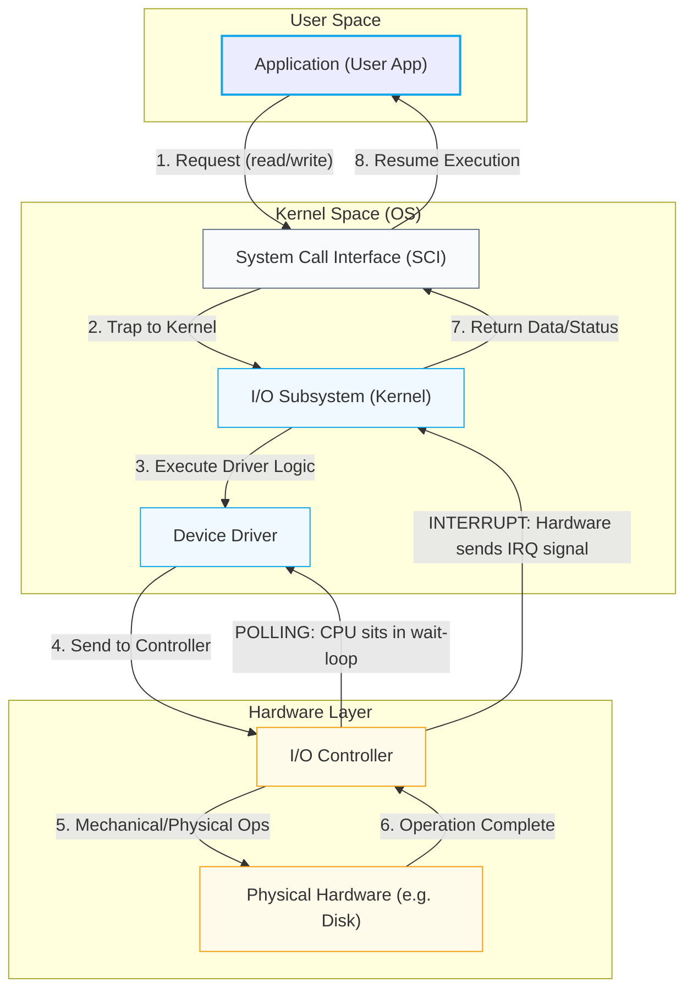

# I/O System Architecture Flowchart

This diagram illustrates the step-by-step lifecycle of an I/O request as it moves through the Operating System and Hardware layers.

### Flowchart Legend
*   **User Space**: Where your applications live.
*   **Kernel Space**: The protected heart of the Operating System.
*   **Hardware Layer**: The physical devices (Platters, Motors, Circuits).
*   **Polling Loop**: The "Are we there yet?" stage where the Driver waits.
*   **Interrupt Signal (IRQ)**: The "Doorbell" that notifies the Kernel when the job is done.
