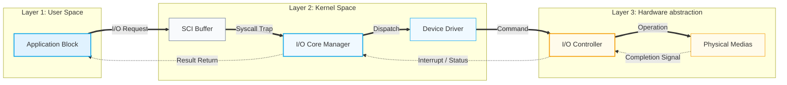

# System Design: I/O Simulator v2.1

This document provides a high-level architectural overview of the I/O Simulator, focusing on the structural blocks and the data flow from Input (Application) to Output (Hardware).

## 4.1 High-Level Block Flow (Input → Output)

---

## Component Block Explanations

### 1. Application Block (The Input)
The entry point of the system. It initiates a request (e.g., READ or WRITE). In our simulator, this is represented by the "Run Execution" trigger. It becomes the "Output" recipient once the data is returned.

### 2. SCI Buffer (System Call Interface)
Acts as the gatekeeper. It captures the request from the user space and safely "traps" it into the kernel space, ensuring the Operating System has control over the operation.

### 3. I/O Core Manager (The Brain)
The central intelligence of the simulator. It decides which model is active (**Polling** vs. **Interrupt**). It manages the process state and calculates the "Efficiency Scores" you see on the dashboard.

### 4. Device Driver
The translator. It takes the abstract I/O request and converts it into specific commands that the hardware controller can understand. In **Polling mode**, the driver is where the "Busy Wait" loop occurs.

### 5. I/O Controller
The hardware interface. It manages the physical device. It sets "Status Bits" that the driver reads (Polling) or sends "Interrupt Requests" (IRQ) to the CPU when the task is done.

### 6. Physical Medias (The Output)
The target hardware (e.g., Disk platter). This block introduces the **Latency** (100ms - 1000ms). The output of the entire system is the successful resolution of the request on this physical layer.

---
*Created for OS Architecture & Documentation Standards.*
